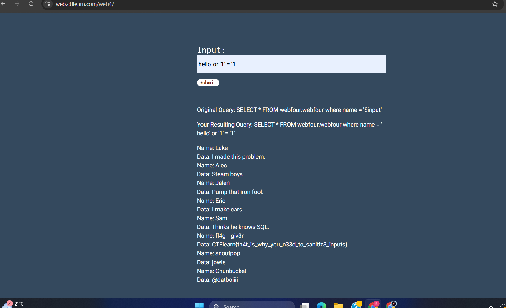

# 🔐 SQL Injection Vulnerability Report

## 📌 Target
Platform: CTFlearn  
Challenge: Basic Injection (web4)

---

## 🧠 Vulnerability Description
SQL Injection is a vulnerability that allows an attacker to manipulate database queries by injecting malicious input. This can lead to unauthorized data access, authentication bypass, and exposure of sensitive information.

---

## 🛠 Tools Used
- Web Browser  

---

## 🔍 Steps to Reproduce

1. Access the vulnerable input field on the web application
2. Enter payload: ' OR '1'='1
3. Submit the request
4. Observe that the application returns all records instead of a filtered result

---

## 💥 Proof of Exploitation

The original query:

SELECT * FROM webfour.webfour WHERE name = '$input'
After injection:
SELECT * FROM webfour.webfour WHERE name = 'hello' or '1'='1'

Since the condition `'1'='1'` is always true, the query returns all records from the database.

---

## 📸 Proof of Concept

The screenshot demonstrates that all records are returned after injecting the payload, confirming successful SQL Injection.

---

## 💥 Impact
- Unauthorized access to database records  
- Exposure of sensitive information  
- Potential for full database compromise

---

## ⚠️ Severity
High

---

## 🧩 Root Cause
The application directly incorporates user input into SQL queries without proper validation or parameterization, making it vulnerable to injection attacks.

---

## 🛡 Remediation
- Use parameterized queries (prepared statements)  
- Validate and sanitize user input  
- Use ORM frameworks  
- Apply least privilege to database accounts  

---

## ✅ Conclusion
The application is vulnerable to SQL Injection due to improper input validation. This allows attackers to manipulate SQL queries and retrieve unauthorized data from the database.
